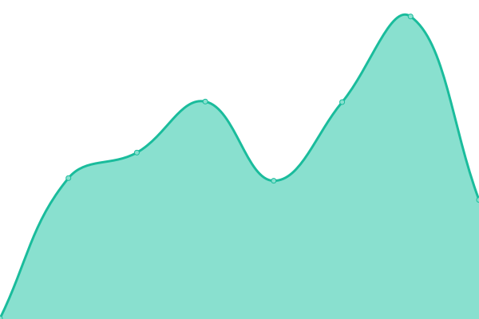
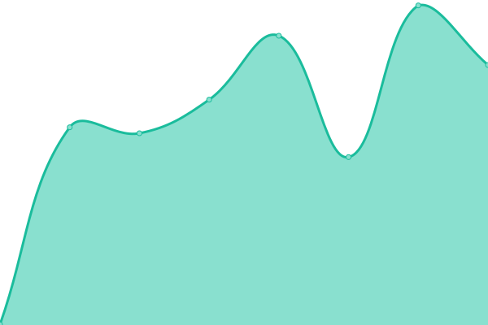

# [📈 Live Status](https://Daga321.github.io/Status-Page): <!--live status--> **🟩 All systems operational**

This repository contains the open-source uptime monitor and status page for [Daniel Alejandro Gomez Acero](http://daga321.is-a.dev/), powered by [Upptime](https://github.com/upptime/upptime).

With [Upptime](https://upptime.js.org), you can get your own unlimited and free uptime monitor and status page, powered entirely by a GitHub repository. We use [Issues](https://github.com/Daga321/Status-Page/issues) as incident reports, [Actions](https://github.com/Daga321/Status-Page/actions) as uptime monitors, and [Pages](https://Daga321.github.io/Status-Page) for the status page.

<!--start: status pages-->
<!-- This summary is generated by Upptime (https://github.com/upptime/upptime) -->
<!-- Do not edit this manually, your changes will be overwritten -->
<!-- prettier-ignore -->
| URL | Status | History | Response Time | Uptime |
| --- | ------ | ------- | ------------- | ------ |
|  [Portafolio](https://daga321.is-a.dev/) | 🟩 Up | [portafolio.yml](https://github.com/Daga321/Status-Page/commits/HEAD/history/portafolio.yml) | 

 367ms
     
 | 

<a href="https://status.daga321.is-a.dev/history/portafolio">100.00%</a>
    

|  [LiquidApp](https://daga321.github.io/LiquidApp/) | 🟩 Up | [liquid-app.yml](https://github.com/Daga321/Status-Page/commits/HEAD/history/liquid-app.yml) | 

 616ms
     
 | 

<a href="https://status.daga321.is-a.dev/history/liquid-app">100.00%</a>
    

<!--end: status pages-->

[**Visit our status website →**](https://Daga321.github.io/Status-Page)

## 📄 License

- Powered by: [Upptime](https://github.com/upptime/upptime)
- Code: [MIT](./LICENSE) © [Anand Chowdhary](https://anandchowdhary.com), supported by [Pabio](https://pabio.com)
- Data in the `./history` directory: [Open Database License](https://opendatacommons.org/licenses/odbl/1-0/)
